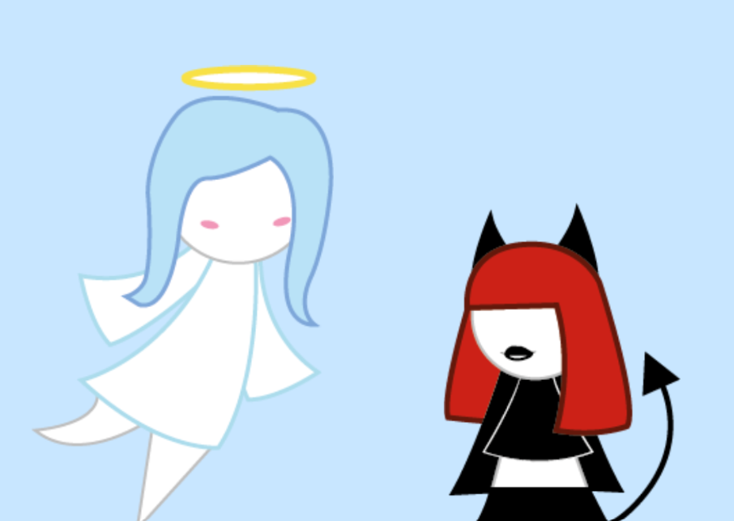

# Examen


### Título del proyecto

Amor Etèreo

### Imagen de referencia de proyecto



### Integrantes

Maira Ramirez S. [MeymeyG](https://github.com/MeymeyG)

### Enlace de p5.js 

<https://editor.p5js.org](https://editor.p5js.org/May_R/sketches/Oee5swvf0>

### Relato inicial

"A" esta en el centro y a su alrededor le prohiben cosas, luego aparece un texro(referente a el poema), "A" observa desde el cielo a "D", Vemos a "D" de cerca, "A" baja desde el cielo para encontrarse con "D"
### Storyboard

Imágenes del storyboard, las que deben verse acá y estar subidas en el mismo repositorio

### Estados

#### Estado 1
“A” está en una escena oscura. Al hacer clic en la pantalla, empiezan a aparecer “Nos” en distintas posiciones. Con cada clic, aparecen más y la pantalla se va oscureciendo progresivamente. Cuando se llega a 35 clics, se pasa al siguiente estado.

```js
//inicio escenas de nos

function escena_no() {

  let altoAngel = height * 1.4;

image(
  ImgAEsc1,
  width / 2,
  height / 2,
  altoAngel * ImgAEsc1.width / ImgAEsc1.height,
  altoAngel
);

  let oscuridad = map(clicks, 0, 60, 0, 255);
  fill(0, oscuridad);
  rect(0, 0, width, height);

  fill(255);

  for (let n of nos) {
    textSize(n.size);
    textFont("Times New Roman");
    text("NO", n.x + random(-2, 2), n.y + random(-2, 2));
  }
}
```

#### Estado 2

Aparece una pantalla con fondo liso y un texto centrado en pantalla. Debajo del texto aparece una flecha hacia abajo que indica que el usuario debe continuar usando la tecla ↓ para avanzar.

```js
//escena de texto

function escena_texto() {


  fill(255);
  textSize(40);

  text(
    "No puedes amarla,\nsusurran,\nporque es un pecado.",
    width / 2,
    height / 2
  );
  
   textSize(30);
  text("↓", width / 2, height * 0.75);
```

#### Estado 3

Aparece una nube con texto en pantalla. Al presionar la flecha hacia abajo, la nube se desplaza hacia arriba, revelando la escena donde “A” observa a “D” desde lo alto. A medida que la nube sube, la pantalla se oscurece progresivamente y se debe seguir presionando la tecla ↓ hasta completar su desplazamiento.

```js
function escena_nube() {


  dibujar_infierno();

  let t = map(progresoNube, 10, 20, 0, 1);
  t = constrain(t, 0, 1);

  push();

  translate(0, nubeY);

  let altoNube = height * 1.4;

  image(
    ImgNubeEsc3,
    width / 2,
    height / 2,
    altoNube * ImgNubeEsc3.width / ImgNubeEsc3.height,
    altoNube
  );

  // TEXTO DENTRO DE LA NUBE 
  fill(0);
  textSize(24);
  textAlign(CENTER, CENTER);

  text(
    "Solo sonríe ante sus palabras,\nsabiendo que no se han arrodillado ante su altar\nni han probado la divinidad que tienen sus labios.",
    width / 2,
    height / 2
  );

  pop();

  // transición visual (oscurece hacia demonia)
  fill(20, 0, 0, t * 255);
  rect(0, 0, width, height);

  // cambio de estado
  if (progresoNube >= 20) {
    estado = E.DEMONIA;
  }
}
```

#### Estado 4

Al seguir presionando la tecla ↓, aparece un close up del rostro de “D” acompañado de un texto simple. Esta escena se muestra de forma breve, cambiando rápidamente al volver a presionar la tecla, lo que da paso a una nueva escena.

```js
function escena_demonia() {

  let alto = height * 1.3;

image(
  ImgDEsc4,
  width * 0.30,
  height / 2,
  alto * ImgDEsc4.width / ImgDEsc4.height,
  alto
);

  push();
  textAlign(LEFT, CENTER);
  fill(255);
  textSize(26);

  text(
    "Ni han probado\nla divinidad que tiñe\nsus labios. No han \noído sus risitas \nentre besos",
    width * 0.60,
    height / 2
  );

  pop();
}
```

#### Estado 5

En la escena final aparecen “D” y “A” en pantalla. Mediante la rueda del mouse, es posible desplazar a “A” hacia abajo, permitiendo que se acerque y se junte con “D”.

```js

function escena_final() {


  // ÁNGEL movible
  let altoAngel = height * 0.8;

 image(
  ImgAEscf,
  width * 0.25,
  height * 0.15 + movimientoAngel,
  altoAngel * ImgAEscf.width / ImgAEscf.height,
  altoAngel
);

  // DEMONIA que se mueve con scroll
  let altoDemonia = height * 0.8;

 image(
  ImgDEscf,
  width * 0.75,
  height * 0.75,
  altoDemonia * ImgDEscf.width / ImgDEscf.height,
  altoDemonia
);
}
```


